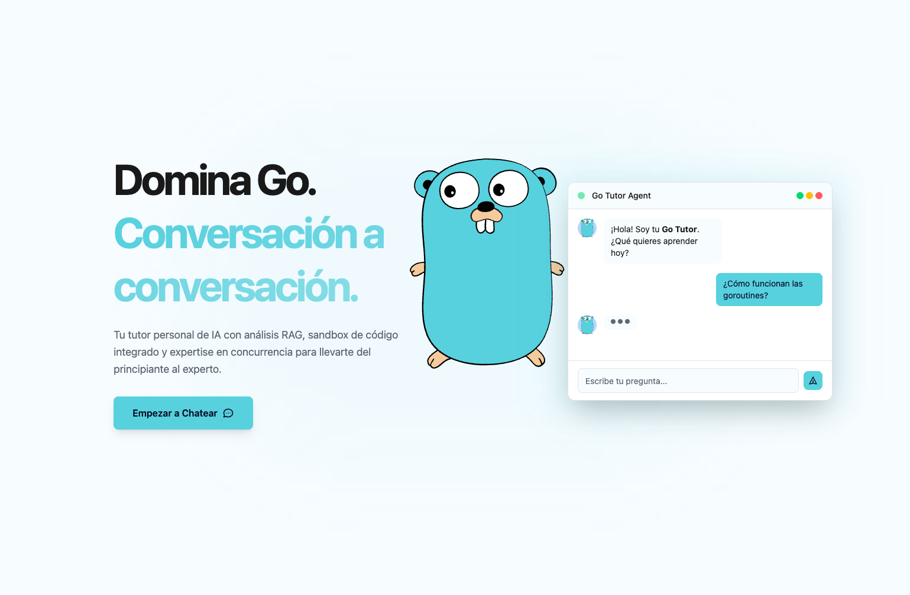
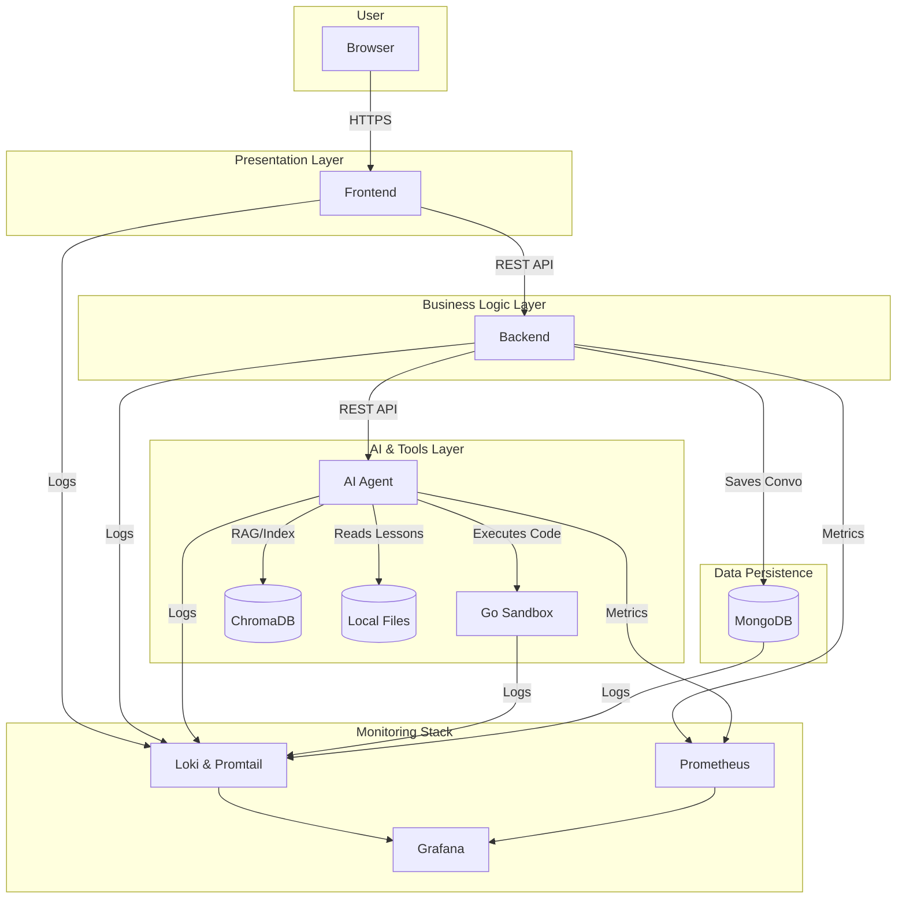
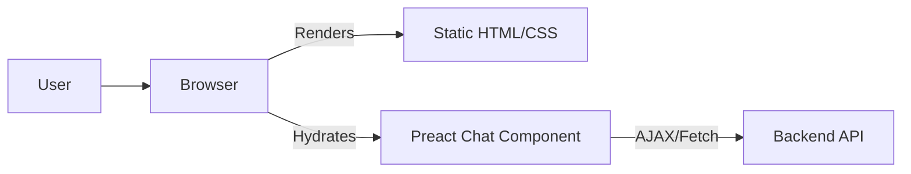
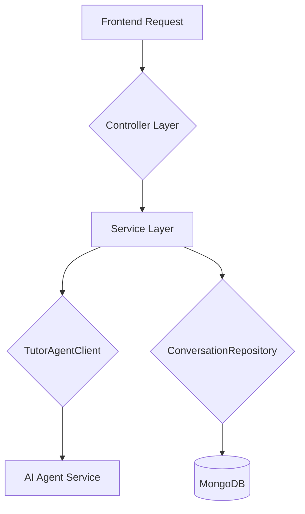
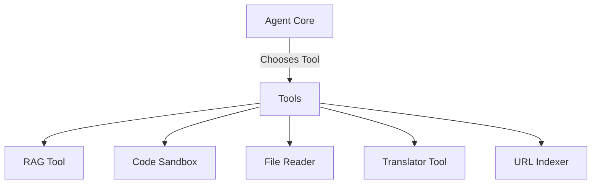
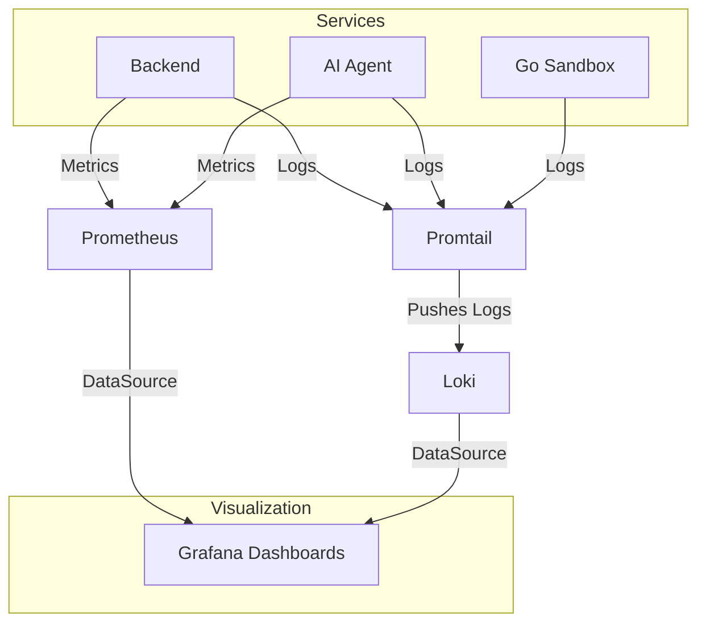

***

<p align="center">
  
</p>

# Go Tutor Agent Project

[](https://www.python.org/downloads/)
[](https://opensource.org/licenses/MIT)
[](https://www.docker.com/)
[](https://spring.io/)
[](https://astro.build/)

Go Tutor Agent is a sophisticated, full-stack AI-powered tutoring system designed to provide a personalized and interactive learning experience for the Go programming language. It leverages a modern microservices architecture, combining a robust Java backend, an intelligent Python AI agent, and a high-performance Astro frontend to deliver a seamless and powerful educational tool.

## 🌐 Live Deployment

You can try the live version of the application right now!

**Access the application here: [https://frontendgotutoragentdeploy.vercel.app/](https://frontendgotutoragentdeploy.vercel.app/)**

-   The **Frontend** is deployed on **Vercel** for optimal performance and global availability.
-   The **Backend**, **AI Agent**, and **Go Executor Service** are deployed on **Railway**.

> **Important Note**: The live agent deployed on Railway has certain limitations due to the platform's resource constraints, especially on the free tier. The RAG (ChromaDB) and Code Sandbox features may experience slower response times or timeouts. For the full, unrestricted experience, running the project locally via Docker Compose is highly recommended.

## ✨ Key Features

-   **Intelligent Conversational AI**: Utilizes a ReAct (Reasoning + Acting) pattern with a modular toolset for contextual and accurate responses.
-   **RAG-Powered Knowledge Base**: Employs a Retrieval-Augmented Generation system over a ChromaDB vector store for answers based on up-to-date documentation.
-   **Secure Code Execution Sandbox**: Safely compiles and runs user-submitted Go code in an isolated Docker container, providing real-time feedback.
-   **SOLID, Layered Backend Architecture**: Built with Spring Boot, ensuring a scalable, secure, and maintainable system core.
-   **Modern, Performant Frontend**: Developed with Astro and Preact Islands for instant page loads and optimized interactivity.
-   **Comprehensive Monitoring Stack**: Full observability into the system's health and performance with Prometheus, Grafana, and Loki.

## 🏗️ Overall Architecture

The project is a monorepo containing multiple microservices that are orchestrated locally via Docker Compose. The architecture is designed for scalability, modularity, and clear separation of concerns.



## 🛠️ Tech Stack

| Component             | Technology                                                               |
| --------------------- | ------------------------------------------------------------------------ |
| **Frontend**          | Astro, Preact, Tailwind CSS                                              |
| **Backend**           | Java 17, Spring Boot, Spring Security, WebFlux                           |
| **AI Agent**          | Python 3.12, FastAPI, Smol-Agents, LiteLLM                               |
| **Code Sandbox**      | Go, Docker                                                               |
| **Database**          | MongoDB (Conversations), ChromaDB (Vector Store)                         |
| **Orchestration**     | Docker, Docker Compose                                                   |
| **Monitoring**        | Prometheus, Grafana, Loki, Promtail                                      |
| **Deployment**        | Railway (Production), Docker Compose (Local)                             |


## 🚀 Getting Started (Local Development)

This guide will help you set up and run the entire project locally using Docker Compose.

### Prerequisites

-   Docker & Docker Compose
-   Git
-   An API Key from an AI provider (e.g., Google AI Studio for Gemini).

### Installation

1.  **Clone the repository:**
    ```bash
    git clone <your-repository-url>
    cd <your-repository-directory>
    ```

2.  **Set up environment variables:**
    Create a file named `.env` in the root directory of the project and paste the following content into it.

    ```env
    # ⚠️ IMPORTANT WARNING ⚠️
    # *** YOU ONLY NEED TO PROVIDE ONE API KEY FOR THE AGENT TO WORK ***
    # *** THE FREE API KEY FROM aistudio.google.com IS RECOMMENDED ***
    # *** FOR A SUPERIOR EXPERIENCE, USE THE gemini-2.5-pro MODEL ***

    # --- Agent API Keys (Choose and fill one) --- 
    OPENROUTER_API_KEY="your_openrouter_or_mistral_key_here"
    MISTRAL_MODEL_ID="mistralai/mistral-7b-instruct"

    GEMINI_API_KEY="your_gemini_api_key_here"
    GEMINI_MODEL_ID='gemini/gemini-2.5-pro'

    OPENAI_API_KEY='your_openai_api_key_here'
    OPENAI_MODEL_ID='gpt-4-turbo'

    # --- MongoDB Credentials ---
    MONGO_INITDB_ROOT_USERNAME=admin
    MONGO_INITDB_ROOT_PASSWORD=password

    # --- Mongo Express UI Credentials ---
    ME_CONFIG_BASICAUTH_USERNAME=admin
    ME_CONFIG_BASICAUTH_PASSWORD=password

    # --- Spring Boot Admin Credentials ---
    SPRING_ADMIN_USER=admin
    SPRING_ADMIN_PASSWORD=secret_password

    # --- Internal Service URLs (for Docker Compose) ---
    # These should not be changed for local development
    GO_EXECUTOR_URL="http://go-executor-service:8090"
    VITE_API_URL="http://localhost:8080"
    ```
    **Remember to replace `"your_..._key_here"` with your actual API key.**

3.  **Run the entire stack:**
    From the root directory, execute the following command:
    ```bash
    docker-compose up --build
    ```
    This will build the images for all services and start them. The `--build` flag is important for the first run and whenever you make code changes.

### Verification

Once all containers are running, you can access the services at:

-   **Frontend Application**: `http://localhost:4321`
-   **Backend API (Health)**: `http://localhost:8080/management/health`
-   **AI Agent API (Health)**: `http://localhost:8000/health`
-   **Mongo Express UI**: `http://localhost:8081`
-   **Grafana Dashboard**: `http://localhost:3000`
-   **Prometheus UI**: `http://localhost:9090`

---


### Verification

Once all containers are running, you can access the services at:

-   **Frontend Application**: `http://localhost:4321`
-   **Backend API (Health)**: `http://localhost:8080/management/health`
-   **AI Agent API (Health)**: `http://localhost:8000/health`
-   **Mongo Express UI**: `http://localhost:8081`
-   **Grafana Dashboard**: `http://localhost:3000`
-   **Prometheus UI**: `http://localhost:9090`

---

## Frontend (`go_agent_frontend`)

The user interface is built with Astro for maximum performance, leveraging a modular architecture and Preact for interactive components.



-   **Astro Framework**: Provides an "Islands Architecture" where most of the site is static HTML, ensuring instant load times. Only interactive components are loaded as JavaScript.
-   **Preact Islands**: The chat interface is a highly interactive component built with Preact, which is "hydrated" on the client-side.
-   **AJAX Communication**: The Preact chat component communicates with the Spring Boot backend asynchronously via the Fetch API to send prompts and receive responses.
-   **Modular Architecture**: Components are organized by feature (chat, info, navigation) for easy maintenance and scalability.

## Backend (`go_tutor_backend`)

The backend is a robust, enterprise-grade application built on Spring Boot, serving as the central hub that connects the frontend to the AI agent and manages data persistence.



-   **SOLID Principles & Layered Architecture**: The code is strictly organized into layers (Controller, Service, Repository, Client) to ensure separation of concerns, testability, and maintainability.
-   **MongoDB Integration**: Used for storing conversation histories, allowing for future analysis and potential fine-tuning of the agent.
-   **JUnit5 & Mockito**: A comprehensive suite of unit and integration tests ensures code quality and reliability.

## AI Agent (`go_tutor_agent`)

The core intelligence of the system. This Python service uses FastAPI for its API and the `smol-agents` library to orchestrate a ReAct (Reasoning + Acting) loop.



-   **FastAPI Framework**: Provides a high-performance, asynchronous API for the agent.
-   **Smol-Agents Library**: A lightweight framework for building autonomous agents with reasoning capabilities.
-   **Modular Toolset**: The agent is equipped with five distinct tools:
  
    1.  **RAG (Retrieval-Augmented Generation)**: Searches a ChromaDB vector database to provide contextually relevant answers.
    2.  **File Reader**: Reads directly from the local `/data` directory to access curated Go lessons.
    3.  **URL Indexer**: Scrapes and indexes content from web pages to expand its knowledge base.
    4.  **Code Sandbox**: Delegates Go code execution to the secure `go_executor_service`.
    5.  **Translator**: Ensures all final responses are delivered in Spanish.
    
-   **Model Extensibility**: Designed to be model-agnostic, easily configurable to use models from Gemini, Mistral, or OpenAI.

## Monitoring Stack

A full observability stack is included to monitor the health and performance of all services.



-   **Prometheus**: Scrapes and stores time-series metrics from the backend and AI agent for performance monitoring.
-   **Promtail**: An agent that collects logs from all running Docker containers.
-   **Loki**: A log aggregation system, inspired by Prometheus, that stores and makes logs queryable.
-   **Grafana**: The visualization platform. It connects to Prometheus and Loki as data sources to create dashboards that display metrics and logs in one place.

## 🙏 Acknowledgements

The Go Gopher images used in the `info` and `install` pages are from the **GolangUA Gopher Logos** repository. A big thank you to the creators and contributors.

-   [GolangUA/gopher-logos on GitHub](https://github.com/GolangUA/gopher-logos)

## 👨‍💻 Author

This agent system was designed and developed by **José Carlos Cataluña Rubio**.

-   **GitHub:** [@JosCarRub](https://github.com/JosCarRub)
-   **Contact:** [contacto@josecarlosdev.com]
## 📄 License

This project is licensed under the MIT License.
